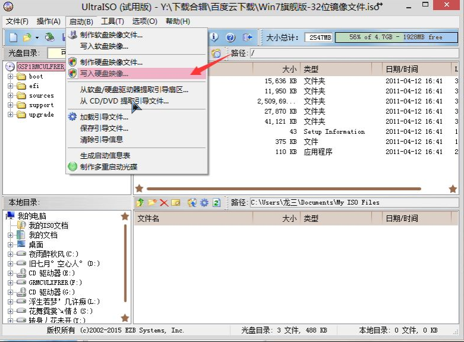

---

[TOC]

---

# 重装系统

> 安装系统不区分windows和linux，方式都是一样的

## u盘启动盘制作

### 方式一

1. 百度搜索[微软官网工具](https://www.microsoft.com/zh-cn/software-download/windows10/)

   

2. 下载后，使用管理员身份运行

3. 按步骤操作，其中下载镜像会比较耗时(好像只能下载win10)

4. 制作启动盘完成后，就可以开始安装系统了

### 方式二

1. 百度搜索[itellyou](https://msdn.itellyou.cn/)，下载系统镜像

   

2. 下载u盘启动盘制作工具[UltraISO](https://cn.ultraiso.net/xiazai.html)，安装后执行

   

   

3. 制作启动盘完成后，就可以开始安装系统了

## 磁盘格式化

> 以 UEFI 启动的 Windows 磁盘必须是 GPT 格式，这里介绍如何在安装 Windows 期间将磁盘从 MBR 转换成 GPT。
> 在安装界面按`Shift+F10`或`Fn+Shift+F10`进入cmd界面

* 输入`diskpart`，进入管理界面

* 输入`list disk`查看所有的磁盘情况

  ```cmd
    磁盘 ###  状态           大小     可用     Dyn  Gpt
    --------  -------------  -------  -------  ---  ---
    磁盘 0    联机              119 GB   118 GB        *
    磁盘 1    联机              465 GB  1024 KB
    磁盘 2    联机               28 GB      0 B        *
  ```

* 选择磁盘`select disk 1`

  注意这里选择的是磁盘，而**不是分区**！**不是**通常所说的 C 盘/D 盘，而是一块 SSD，或一块机械硬盘。

* 执行`clean`或`clean all`清除所有数据

  操作会**清除选中磁盘中的所有数据**，是所有数据，毫无保留！

* 清除结束，然后敲入 `convert gpt` 命令完成转换

* 操作结束之后输入`exit`切换到 Windows 安装程序继续安装即可

* 激活工具([点击下载](https://share.weiyun.com/pieGqnrl))

## 主板启动热键

> 表中没有的机型尝试：ESC、下F8、9、F10、11、F2

| 台式机品牌 | 启动按键 | 笔记本品牌 | 启动按键 | 主板品牌 | 启动按键 |
| ---------- | -------- | ---------- | -------- | -------- | -------- |
| 联想       | F12      | 联想       | F12      | 华硕     | F8       |
| 惠普       | F12      | 戴尔       | F12      | 微星     | F11      |
| 华硕       | F8       | 华硕       | ESC      |          |          |
| 戴尔       | ESC      | 惠普       | F9       |          |          |
| 神舟       | F12      | 联想       | F12      |          |          |

> 有些联想电脑有**NOVO键**是一键恢复按键。在电脑的侧面有个很小的按钮，旁边有标号——“一个逆时针箭头”，作用是：关机状态下，按此按键可启动联想一键恢复系统或,BIOS，设置程序，或者进入启动菜单

# 软件安装

## 必装软件

> 微软`Office`

办公软件是指可以进行文字处理、表格制作、幻灯片制作、图形图像处理、简单数据库的处理等方面工作的软件。
办公软件朝着操作简单化，功能细化等方向发展。链接下载([点我下载2016版](https://share.weiyun.com/mANzYS3c))

> 删除软件`IOBit`

**IObit Uninstaller**最新版是款功能高效的卸载工具。IObit Uninstaller官方版可轻松卸载并消除您电脑中的所有程序及文件，并在卸载后极速搜索注册表，找出残余信息并删除。并且**IObit Uninstaller**中还有一键移除工具列，批次移除和强制移除等功能。[点我下载](https://share.weiyun.com/jhGQZE8U)

> `chrome`浏览器

百度搜索`chrome浏览器`，下载最新版本安装即可

> 可牛看图

一个功能强大且体积小巧的电脑看图工具，拥有丰富多样的图片浏览方式以及炫酷动感3D图片墙，支持批量图片上传、支持图片批量下载([官网下载](https://www.keniu.com/)，[微云下载](https://share.weiyun.com/mLzsFDdu))

> 极速PDF阅读器

极速PDF阅读器([点我下载](https://jisupdf.com/))是一款闪电般好用的PDF阅读器,体积小、启动速度快,十分轻巧且占用内存极少;提供单页、书本模式个性阅读,又有全屏、幻灯片等功能

## 进阶软件

> everything

`Everything`([点我下载](https://www.voidtools.com/zh-cn/))是voidtools开发的一款文件搜索工具，它体积小巧，界面简洁易用，快速建立索引，快速搜索，同时占用极低的系统资源，实时跟踪文件变化，并且还可以通过http或ftp形式分享搜索

> Treesize

TreeSize Pro是一款优秀的磁盘空间管理工具。凭借其多样化的功能深受用户喜爱。通过该软件能够有效管理和清理磁盘空间，可视化磁盘空间的使用情况，详细分析目录级别，显示目录大小，包括所有子目录，直观呈现为饼图或条形状，所有信息一目了然([官网-需要自己找注册码](https://www.jam-software.com/treesize_free)、[百度云下载](https://pan.baidu.com/s/1Rqz4JUBV6nnNJYb2eMRISQ)-提取码: wqd1)

> visio

`Microsoft Visio`是Windows 操作系统下运行的流程图软件，它现在是Microsoft Office软件的一个部分。
Visio可以制作的图表范围十分广泛，有些人利用Visio的强大绘图功能绘制地图、企业标志等，同时Visio支持将文件保存为svg、dwg等矢量图形通用格式，因此受到广泛欢迎。链接下载([点我下载2016版](https://share.weiyun.com/mANzYS3c))

> Gow

`Gow`([点我下载](https://github.com/bmatzelle/gow/releases))是一个轻量级的[Cygwin](https://baike.baidu.com/item/Cygwin)替代软件，它能做的事情是给Liunx软件提供一个Windows系统上的运行环境
安装后可以直接在windows上执行linux的大部分命令

> Vmware

`VMware Workstation Pro` [点我下载](https://www.vmware.com/cn/products/workstation-pro.html)是行业标准桌面 Hypervisor，使用它可在 Windows 或 Linux 桌面上运行 Windows、Linux 和 BSD 虚拟机。[激活码全家桶](https://appnee.com/vmware-workstation-pro-universal-license-keys-collection/)

> typora

`Typora`([点我下载](https://www.typora.net/))是一款跨平台的Markdown编辑器软件,拥有Windows、macOS客户端

> neatreader

Neat Reader([点我下载](https://www.neat-reader.cn/))率先在业界实现了主流平台的全面支持，让你无需再在各个软件间来回切换，真正实现了无拘无束，随时随地阅读体验，致力于打造一个满足现代需求的 EPUB/TXT 阅读器

> PandaOCR

PandaOCR([普通版](https://github.com/miaomiaosoft/PandaOCR)，[专业版](https://github.com/miaomiaosoft/PandaOCR.Pro))是一款专注于 Windows 桌面端 OCR 文字识别的免费软件，支持多功能 OCR 识别、即时翻译和朗读等。而且识别和翻译等引擎都是可以自由调换的，界面简洁，使用起来也很方便
PandaOCR.Pro同样是免费使用，但它有一个激活专业版本状态，在未激活状态下您可以使用除高级功能外的全部功能，同时识别或翻译等功能可使用演示接口和百度API版接口，普通使用基本足够

## IT软件

> git

* git[官网下载](https://git-scm.com/downloads)

  ```sh
  git config --global user.name "narutohyc"
  git config --global user.mail "1832044043@qq.com"
  # 配置远程仓库 将pub_key黏贴到git
  ssh-keygen -t rsa -C "1832044043@qq.com"
  ```

* TortoiseGit([海龟 Git](https://tortoisegit.org/download/))是TortoiseSVN的 Git 版本，用于迁移 TortoiseSVN 到TortoiseGit，TortoiseGit 是一个 Git 版本控制客户端，作为 Microsoft Windows 的外壳扩展实现，[配置教程](https://blog.csdn.net/qq_42234452/article/details/108629426)

> jdk

[官网下载](https://www.oracle.com/java/technologies/downloads/)，主要配置参考

```sh
export JAVA_HOME=/usr/java/jdk1.8.0_241-amd64
export JRE_HOME=/usr/java/jdk1.8.0_241-amd64/jre
export PATH=$PATH:$JAVA_HOME/bin:$JRE_HOME/bin
export CLASSPATH=.:$CLASSPATH:$JAVA_HOME/lib:$JRE_HOME/lib
```

> pycharm

[官网下载](https://www.jetbrains.com/pycharm/)，[IDE全家桶激活码](http://www.lookdiv.com//)，验证码输入`lookdiv.com`

> navicat

提供简便的管理方法，设计和操作MySQL、MariaDB、SQL Server、Oracle、PostgreSQL和SQLite的数据([点我下载](https://pan.baidu.com/s/1NNP5Z2_vEgeo5RQ6nfV7kg)-提取码: 6sp9)

> Power Designer

是Sybase公司的CASE工具集，使用它可以方便地对管理信息系统进行分析设计，它几乎包括了数据库模型设计的全过程。利用PowerDesigner可以制作数据流程图、概念数据模型(ConceptualDataModel)、物理数据模型(PhysicalDataModel)，还可以为数据仓库制作结构模型，也能对团队设计模型进行控制。([官网-需要自己找注册码](http://www.navicat.com.cn/www.navicat.com.cn/company/press/345-navicat-%E7%89%88%E6%9C%AC-15-%E6%AD%A3%E5%BC%8F%E5%8F%91%E5%B8%83.html)、[百度云下载](https://pan.baidu.com/s/1OK1qogjHalxVOCWM8yWGZg)-提取码: n3xz)

> finalshell

免费的国产的集 SSH 工具、服务器管理、远程桌面加速的良心软件，同时支持 Windows，macOS，Linux，它不单单是一个 SSH 工具，完整的说法应该叫一体化的的服务器，网络管理软件，在很大程度上可以免费替代 XShell，是国产中不多见的良心产品，具有免费海外服务器远程桌面加速，ssh 加速，双边 tcp 加速，内网穿透等特色功能([点我下载](http://www.hostbuf.com/))

> Officebox

**完全免费**的PDF工具/万能格式转换/识别工具/图片处理，多达60+个小工具，提供绿色版([点我下载](http://www.wofficebox.com/))

> Wolfram Mathematica

一款数学计算软件，具有编程语言、文本系统、计算引擎、图形系统等多种特色功能，并且还完美支持支持高性能计算，让用户科学计算的过程中，充分的发挥出自身的优势等。可以用于画函数图像([点我下载](https://pan.baidu.com/s/14ImWTscWl9syCZ_mtWacww)-提取码: 52qa)

# Chrome扩展程序

> 没有插件的浏览器无异于没有灵魂！以下扩展程序的离线包[微云下载](https://share.weiyun.com/fkSZyb8p)

> 插件下载地址

* [crx4chrome](https://www.crx4chrome.com/): 下载指定扩展id的crx文件
* [extfans](https://www.extfans.com/)
* [huajiakeji](https://huajiakeji.com/)
* [crxdown](https://crxdown.com/)
* [应用商店](https://chrome.google.com/webstore/category/extensions?hl=zh-CN)

## 翻墙类

> Astar VPN

`Astar VPN `- 适合所有人的免费且快速的 VPN

> Ghelper

[官网](http://googlehelper.net/)需要翻墙

## 脚本管理工具

### 扩展

> 油猴`Tampermonkey`

> 暴力猴`Violentmonkey`

### 脚本下载与推荐

> 脚本下载地址

* [openuserjs](https://openuserjs.org/)

* [greasyfork](https://greasyfork.org/zh-CN/scripts)

> 脚本推荐

* 百度网盘直接下载助手
* 网盘直链下载助手
* 解锁B站大会员番剧、B站视频解析下载；全网VIP视频免费破解去广告；全网音乐直接下载；油管、Facebook等国外视频解析下载；网盘搜索引擎破解无限下载等
* 破解VIP会员视频集合

## 下载类

* `Chrono下载管理器`: 做Chrome浏览器中最好的下载管理器
* `nternet Download Manager`: 您可以使用Internet下载管理器下载
* `Stream Recorder`: 可以下载99%在线视频，包括直播流、m3u8流
* `Fatkun图片批量下载`: 可以下载当前标签或者是所有标签的图片，提供按分辨率、链接等筛选图片

## 效率类

> `书签管理`: 在任何页面都可以通过书签关键字快速搜索打开书签,管理您的书签
>
> `书签地球助手`: 一款很优秀好用的网页浏览器上的书签管理助手，帮助用户一键整理网页标签，自定义标签设置方法，同时还可以查询搜索历史记录

> `广告拦截`

* **AdGuard 广告拦截器**是一款无与伦比的广告拦截扩展，用以对抗各式广告与弹窗。可以拦截 Facebook、YouTube 和其它所有网站的广告
* **广告终结者**能清除网页上的所有广告：浮动广告，购物广告，恶意弹窗，跟踪代码。让你浏览网页更快更清爽

> `扩展管理器(Extension Manager)`: 一键管理所有扩展，快速开启/禁用、批量闪电管理，智能排序，右键卸载、锁定、选项配置，角标提醒，大小布局随心配。快捷、简单、安全

> `Simple Allow Copy`: 简易复制

> `Reader View`: 剥离按钮、背景图像等杂物，改变页面的文字大小、对比度和布局，以提高可读性

> `在线合并PDF`: 快速免费合并PDF文件！

> `Diigo Web Collector` 像在本子上一样为网页做笔记

> `Docs Online Viewer`: 直接在谷歌浏览器中在线查看任何文件

> `Instapaper`是一款运行在chromr内核的能够即时保存网页的chrome网页离线阅读插件

> `Mate Translate`是一款词典翻译类插件，可轻松翻译 103 种语言的单词、短语或文件。
> 功能包含 [全页翻译]: 只要单击鼠标，Mate 就会为您翻译整个网页！在任何页面上，只要使用上下文菜单中的“翻译此页面”功能，就可立即翻译为您想要的语言

> `Video Downloader professional`是一款网页视频下载工具，下载前请先播放视频

> `FireShot`不仅支持区域截图，还支持完整的长网页截图

> `Grammarly for Chrome`: 国外最火的文字纠错工具，英语写作助手，帮助你在输出过程中找出英语单词拼写、语法、语调等问题，它为你提供具体的建议，帮助你提高英语写作水平

## 程序员类

* `Octotree - GitHub code tree`
* `Postman Interceptor`
* `Sourcegraph`
* `GitZip for github`
* `JSON Viewer Pro`

## 浏览器美化类

* `MONKNOW 新标签页 - 个性化面板`
* `Stylish-为任意网站自定义主题`: 利用用户样式管理器Stylish来重新编辑网站的样式，可利用Stylish为许多网站安装主题和皮肤，也可创建自己的主题和皮肤

# 局域网ftp共享

**FTP(File Transfer Protocol)**是TCP/IP网络上两台计算机传送文件的协议，使得主机间可以共享文件
目前有很多软件都能实现这一功能，然而windows 8系统自带的IIS就可以帮助你搭建FTP服务器

* 打开`控制面板` -> `程序` -> `启用或关闭windows功能`

* 找到`Internet信息服务`，并选中`FTP服务`、`FTP扩展性`和`IIS管理控制台`前的复选框，点击确定

  

* 打开`IIS管理器`，在左栏的`网站`上点击右键，打开`添加FTP站点`

  `win+r`后输入`inetmgr`，即可打开`IIS管理器`

* 开始配置

  

* 在电脑浏览器地址栏中输入`ftp://本机ip`测试一下

* 在启动你的FTP服务器时建议关闭防火墙


