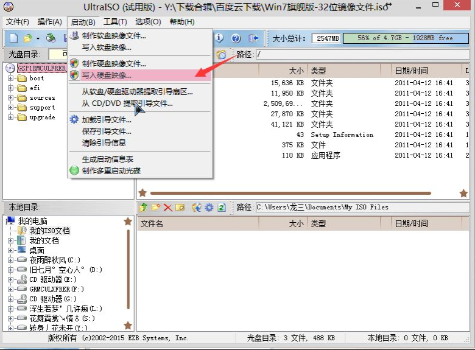

# 重装系统

## u盘启动盘制作

### 方式一

1. 百度搜索[微软官网工具](https://www.microsoft.com/zh-cn/software-download/windows10/)

   

2. 下载后，使用管理员身份运行

3. 按步骤操作，其中下载镜像会比较耗时(好像只能下载win10)

4. 制作启动盘完成后，就可以开始安装系统了

### 方式二

1. 百度搜索[itellyou](https://msdn.itellyou.cn/)，下载系统镜像

   

2. 下载u盘启动盘制作工具[UltraISO](https://cn.ultraiso.net/xiazai.html)，安装后执行

   

   

3. 制作启动盘完成后，就可以开始安装系统了

## 磁盘格式化

> 以 UEFI 启动的 Windows 磁盘必须是 GPT 格式，这里介绍如何在安装 Windows 期间将磁盘从 MBR 转换成 GPT。
> 在安装界面按`Shift+F10`或`Fn+Shift+F10`进入cmd界面

* 输入`diskpart`，进入管理界面

* 输入`list disk`查看所有的磁盘情况

  ```cmd
    磁盘 ###  状态           大小     可用     Dyn  Gpt
    --------  -------------  -------  -------  ---  ---
    磁盘 0    联机              119 GB   118 GB        *
    磁盘 1    联机              465 GB  1024 KB
    磁盘 2    联机               28 GB      0 B        *
  ```

* 选择磁盘`select disk 1`

  注意这里选择的是磁盘，而**不是分区**！**不是**通常所说的 C 盘/D 盘，而是一块 SSD，或一块机械硬盘。

* 执行`clean`或`clean all`清除所有数据

  操作会**清除选中磁盘中的所有数据**，是所有数据，毫无保留！

* 清除结束，然后敲入 `convert gpt` 命令完成转换

* 操作结束之后输入`exit`切换到 Windows 安装程序继续安装即可

## 主板启动热键


|      |      |
| ---- | ---- |
|      |      |
|      |      |