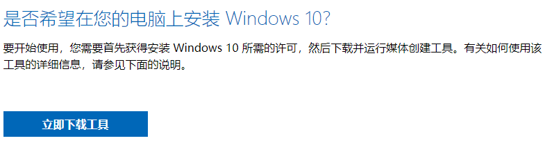
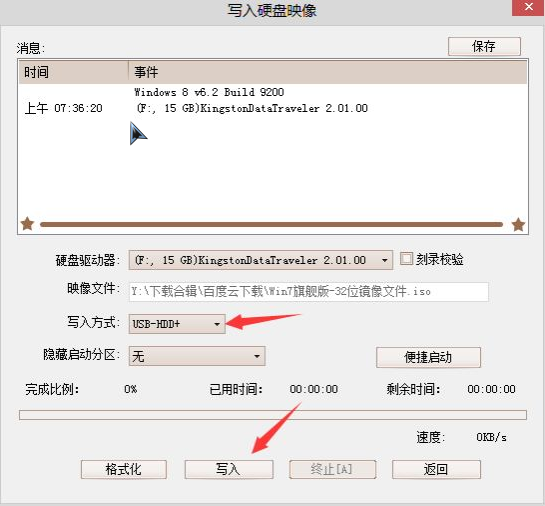

# 重装系统

## u盘启动盘制作

### 方式一

1. 百度搜索[微软官网工具](https://www.microsoft.com/zh-cn/software-download/windows10/)

   

2. 下载后，使用管理员身份运行

3. 按步骤操作，其中下载镜像会比较耗时(好像只能下载win10)

4. 制作启动盘完成后，就可以开始安装系统了

### 方式二

1. 百度搜索[itellyou](https://msdn.itellyou.cn/)，下载系统镜像

   

2. 下载u盘启动盘制作工具[UltraISO](https://cn.ultraiso.net/xiazai.html)，安装后执行

   

   

3. 制作启动盘完成后，就可以开始安装系统了

## 主板启动热键

|      |      |
| ---- | ---- |
|      |      |
|      |      |