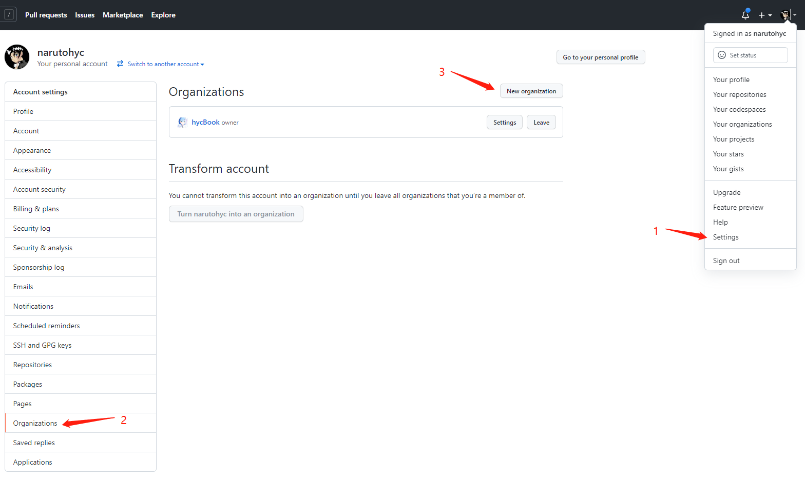
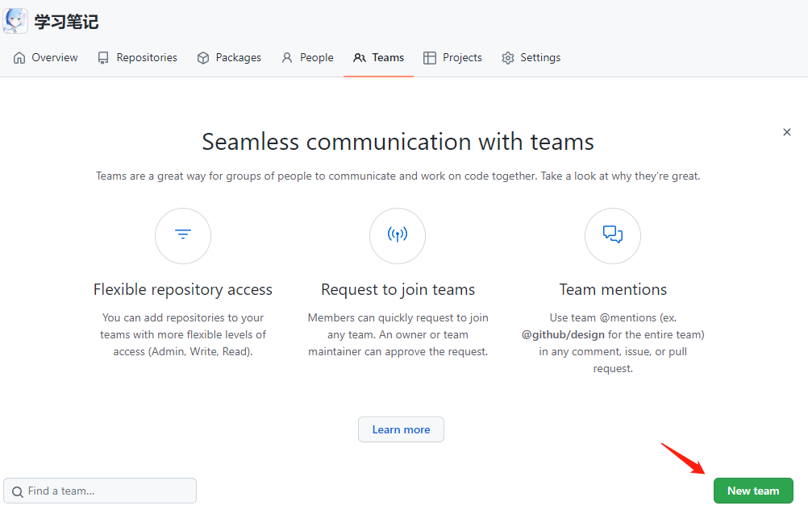
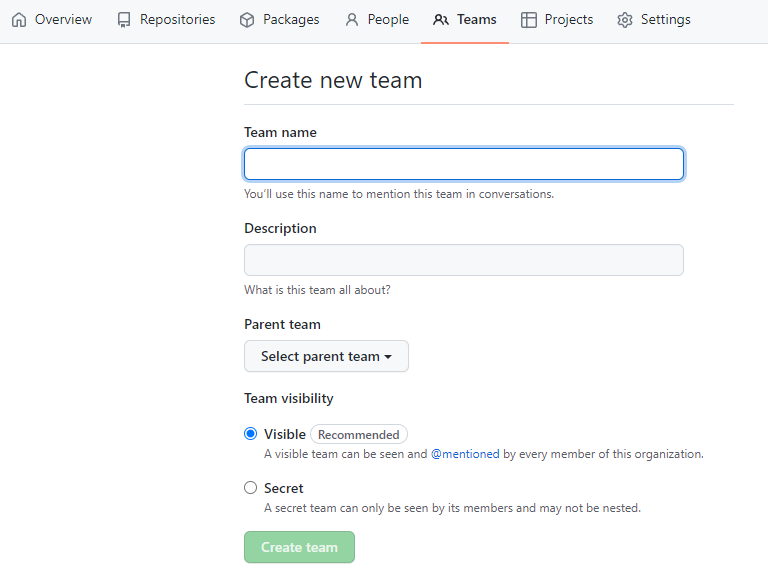
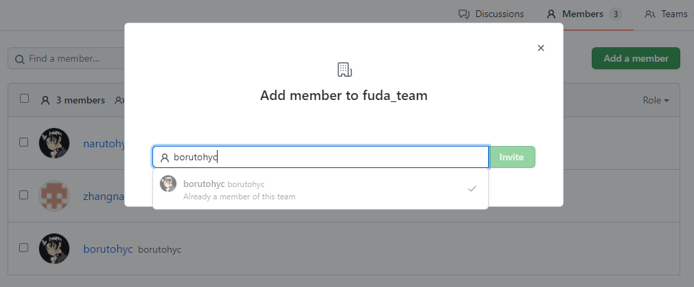
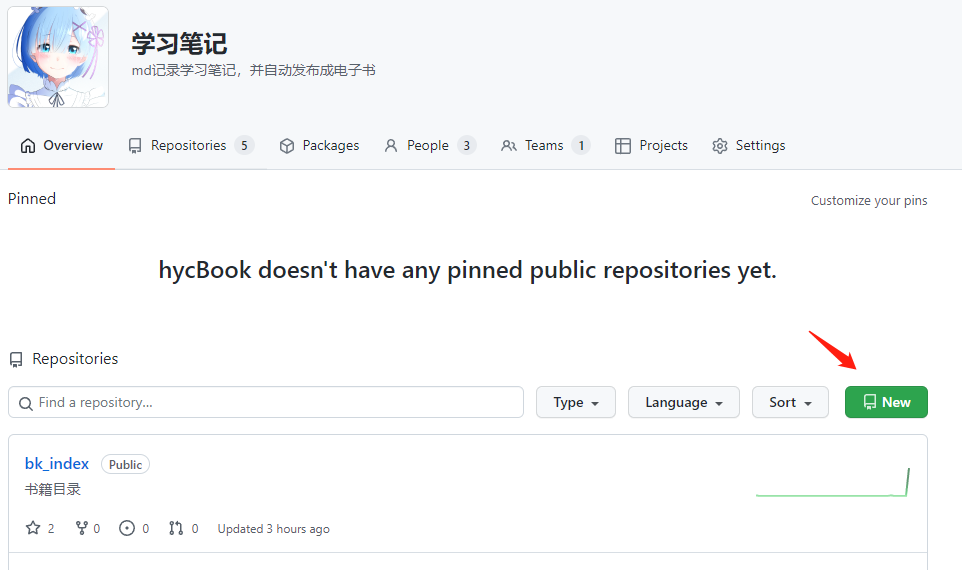
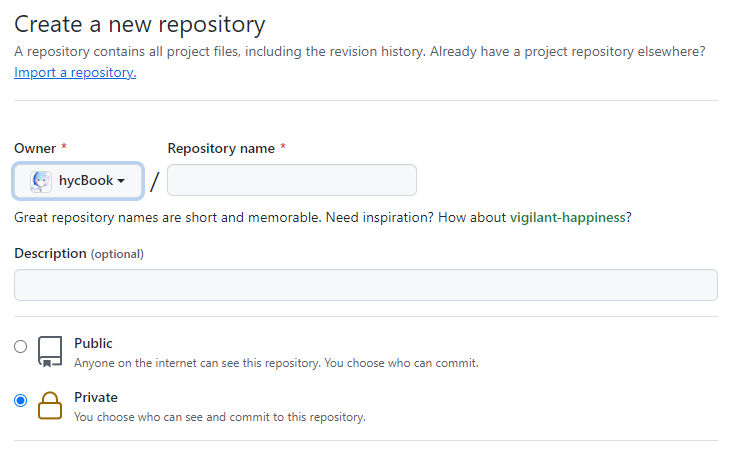
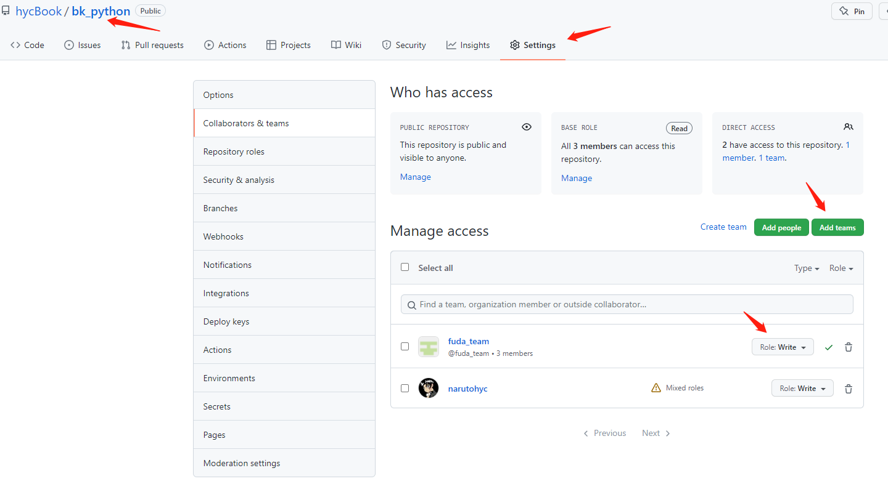
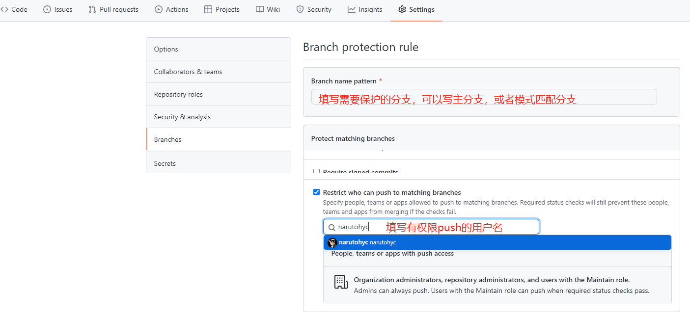
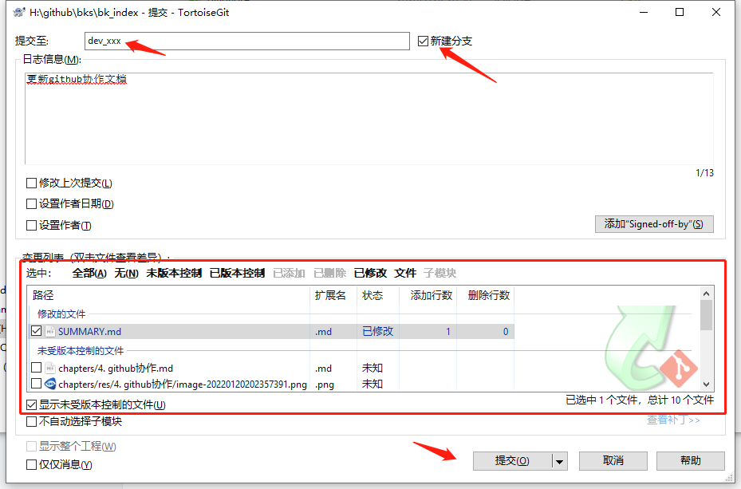
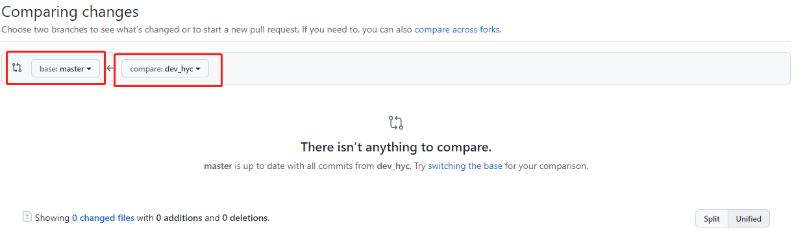

# github协作

> [GitHub 多人协作开发三种方式](https://www.cnblogs.com/gamehiboy/p/5601265.html)

## Fork 方式

> 暂无


## Organizations方式

### 准备项目

> 新建组织(创建免费的即可，有每月免费2000分钟)



> 创建team(不建也是可以，建了容易管理)

<table>
    <tr>
        <td width=53%></td>
        <td></td>
    </tr>
</table>


> 添加team成员，在组织下选择team，给team拉队友，队友收到邮件后，同意了就可以加入



> 仓库转入(原来已有的仓库，进入仓库选择settings，下滑选`Transfer`)或在新建项目

<table>
    <tr>
        <td width=50%></td>
        <td></td>
    </tr>
</table>

> 为组织下的仓库添加合作者，配置权限




> 设置主分支保护，不让其他人直接push到主分支，打开仓库下的settings，选择`branchs`
>
> 添加`Branch protection rules`




### 开始协作

> 协作者在组织下找到对应的仓库，克隆仓库到本地

```sh
git clone git@github.com:hycBook/bk_python.git
```

> 开始编写，完成后提交至新分支，一般命名为`dev_xxx`



> 新分支创建一次就可以，`commit`之后，再`push`到自己的`dev_xxx`分支
>
> `注意：`在修改文件之前一般是先从`主分支`拉取最新内容，修改完成后尽早提交，较少冲突
>
> `commit`和`push`操作都是在自己的`dev_xxx`分支，`pull`操作是从主分支来

> 到github界面，选择`Pull requests`，在选择`New pull request`，选择分支



> 提交合并请求后，等待合并即可


## 合作者

> 暂无


# githun actions

Github Actions 是 Github 推出的自动化构建工具，一般来说，CI / CD （持续集成 / 持续部署）都需要自己的计算资源，但 Github Actions 提供免费的计算资源，这是它的优势之一，用户只用操心 workflow 文件，不用关心环境相关的琐碎，便可部署 CI / CD，加速了流程。

在 GitHub Actions 中，一次执行过程被称为一个 **workflow**，一个 workflow 中可以有一个或者多个 **job**，job 又由 **step** 组成，step 中可以执行 **action**，就是一条条命令

## github同步gitee

> [Hub Mirror Action](https://github.com/Yikun/hub-mirror-action)

一个用于在hub间（例如Github，Gitee）账户代码仓库同步的action

> 准备步骤

1. 本地生成公钥和秘钥

   ```cmd
   ssh-keygen -t -C "1832044043@qq.com"
   ```

2. 公钥放在gitee

3. github项目下新建：name=GITEE_PRIVATE_KEY，value=秘钥

4. gitee生成token

5. github项目下新建：name=GITEE_TOKEN，value=gitee生成的token

> 基本用法

```yml
steps:
    - name: Sync Github Repos To Gitee  # 名字随便起
      uses: Yikun/hub-mirror-action@master  # 使用Yikun/hub-mirror-action
      with:
        src: github/hycBook  # 源端账户名(github),如果是组织的话要用组织名,此时account_type=org
        dst: gitee/hycBook  # 目的端账户名(gitee),如果是组织的话要用组织名,此时account_type=org
        dst_key: ${{ secrets.GITEE_PRIVATE_KEY }}  # SSH密钥对中的私钥
        dst_token:  ${{ secrets.GITEE_TOKEN }}  # Gitee账户的私人令牌
        account_type: org  # 账户类型,
        # clone_style: "ssh"  # 使用https方式进行clone，也可以使用ssh
        debug: true  # 启用后会显示所有执行命令
        force_update: true  # 启用后，强制同步，即强制覆盖目的端仓库
        static_list: "bk_index"  # 静态同步列表，在此填写需要同步的仓库名称，可填写多个
        timeout: '660s'  # git超时设置，超时后会自动重试git操作
```

> 必选参数

- `src` 需要被同步的源端账户名，如github/kunpengcompute，表示Github的kunpengcompute账户。
- `dst` 需要同步到的目的端账户名，如gitee/kunpengcompute，表示Gitee的kunpengcompute账户。
- `dst_key` 用于在目的端上传代码的私钥(默认可以从~/.ssh/id_rsa获取），可参考[生成/添加SSH公钥](https://gitee.com/help/articles/4181)或[generating SSH keys](https://docs.github.com/articles/generating-an-ssh-key/)生成，并确认对应公钥已经被正确配置在目的端。对应公钥，Github可以在[这里](https://github.com/settings/keys)配置，Gitee可以[这里](https://gitee.com/profile/sshkeys)配置。
- `dst_token` 创建仓库的API tokens， 用于自动创建不存在的仓库，Github可以在[这里](https://github.com/settings/tokens)找到，Gitee可以在[这里](https://gitee.com/profile/personal_access_tokens)找到。

> 可选参数

- `account_type` 默认为user，源和目的的账户类型，可以设置为org（组织）或者user（用户），该参数支持**同类型账户**（即组织到组织，或用户到用户）的同步。如果源目的仓库是不同类型，请单独使用`src_account_type`和`dst_account_type`配置。
- `src_account_type` 默认为`account_type`，源账户类型，可以设置为org（组织）或者user（用户）。
- `dst_account_type` 默认为`account_type`，目的账户类型，可以设置为org（组织）或者user（用户）。
- `clone_style` 默认为https，可以设置为ssh或者https。当设置为ssh时，你需要将`dst_key`所对应的公钥同时配置到源端和目的端。
- `cache_path` 默认为'', 将代码缓存在指定目录，用于与actions/cache配合以加速镜像过程。
- `black_list` 默认为'', 配置后，黑名单中的repos将不会被同步，如“repo1,repo2,repo3”。
- `white_list` 默认为'', 配置后，仅同步白名单中的repos，如“repo1,repo2,repo3”。
- `static_list` 默认为'', 配置后，仅同步静态列表，不会再动态获取需同步列表（黑白名单机制依旧生效），如“repo1,repo2,repo3”。
- `force_update` 默认为false, 配置后，启用git push -f强制同步，**注意：开启后，会强制覆盖目的端仓库**。
- `debug` 默认为false, 配置后，启用debug开关，会显示所有执行命令。
- `timeout` 默认为'30m', 用于设置每个git命令的超时时间，'600'=>600s, '30m'=>30 mins, '1h'=>1 hours
- `mappings` 源仓库映射规则，比如'A=>B, C=>CC', A会被映射为B，C会映射为CC，映射不具有传递性。主要用于源和目的仓库名不同的镜像。

## 部署github pages

> [GitHub Pages Deploy Action](https://github.com/JamesIves/github-pages-deploy-action)

自动发布到github pages分支(可以自己设置分支)

> 配置token

github项目下新建：name=TOKEN，value=github生成的token

> 基本用法

```yml
- name: Deploy #步骤4：把编译好的静态目录上传到gh-pages分支上
  uses: JamesIves/github-pages-deploy-action@3.1.5 #这里调用第三方依赖，用于上传代码到指定分支上
  with:
    ACCESS_TOKEN: ${{ secrets.TOKEN }}
    BRANCH: gh-pages #github pages 默认的分支
    FOLDER: _book #上传文件的目录，我这个目录在根目录下，如果是子目录可以这么写  docs/.vuepress/dist
```

## 发布release

> [action-automatic-releases@latest](https://github.com/marvinpinto/action-automatic-releases)

自动创建release，并发布

> 基本用法

```yml
- name: Create GitHub release
  uses: marvinpinto/action-automatic-releases@latest
  with:
    repo_token: ${{ secrets.TOKEN }}
    automatic_release_tag: 'ebook_index' # 发布标签
    title: ${{ env.ReleaseVersion }}
    prerelease: false
    files: |
      _ebook/* # 发布的目录
```

## build gitee pages

> [Gitee 如何自动部署 Pages？还是用 GitHub Actions!](https://zhuanlan.zhihu.com/p/447741514)

使用 GitHub Actions 解决了 GitHub 代码自动同步 Gitee 的问题，但我们的博客仓库代码同步到 Gitee 后，并不能像 GitHub 一样自动部署 Pages，如果不使用付费的 Gitee Pages Pro 服务，那我们该怎么实现 Gitee 自动部署 Pages 呢

> 基本用法

新建一个name=GITEE_PASSWORD, value=gitee登陆密码的secrets

```yml
- name: Build Gitee Pages
  uses: yanglbme/gitee-pages-action@main
  with:
    # 注意替换为你的 Gitee 用户名
    gitee-username: narutohyc
    # 注意在 Settings->Secrets 配置 GITEE_PASSWORD
    gitee-password: ${{ secrets.GITEE_PASSWORD }}
    # 注意替换为你的 Gitee 仓库，仓库名严格区分大小写，请准确填写，否则会出错
    gitee-repo: hycBook/bk_index
    # 要部署的分支，默认是 master，若是其他分支，则需要指定（指定的分支必须存在）
    branch: gh-pages
```


# github

## 基本命令

> 强制覆盖本地文件

```cmd
git fetch --all
git reset --hard origin/master
git pull

# 单条执行
git fetch --all &&  git reset --hard origin/master && git pull
```


# markdwon语法

> [md表情链接~](https://apps.timwhitlock.info/emoji/tables/unicode#block-4-enclosed-characters)

